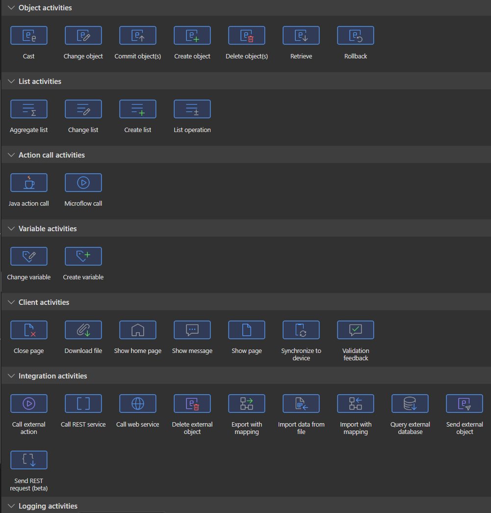
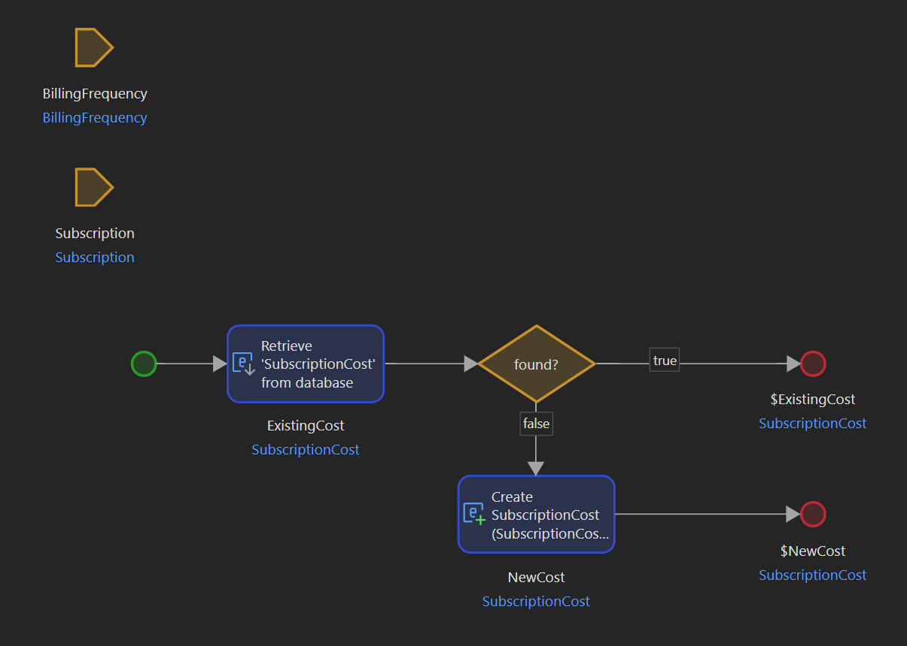

# Getting used to visual software development

Recently I've started using a low-code platform [Mendix](https://www.mendix.com/) to produce software.
I wasn't planning on it, but an opportunity presented itself and I was curious to learn more about this new (to me) thing.

And, to my surprise, I did like it.
Probably the biggest change is passing from writing actual lines of code in text, to visually constructing the software.

For UI, this is not weird at all, it's even much more pleasant than writing HTML/CSS/JavaScript.
For backend though, it's a different story.

## How does it actually work?

Think about this: when you need to code something complex, you normally don't start writing code right away.
You think about it, draw something down on a whiteboard or a piece of paper, identify some patterns, and only then start coding.

With Mendix, the process feels very similar, except that the last 'coding' part is very different.

Here's how the process looks like in Mendix:
1. You create a new _microflow_. Microflows are where your business logic gets executed. I like to think of them as a method in a service class. You can call other microflows from within.
1. You drag and drop which elements you need to implement your logic. You will do the same things as you would in Java: create variables, retrieve stuff from the database, modify objects, loop collections, have conditional statements, etc...
1. At the end of the microflow, you might return something, or not return anything. You might commit an object to the DB, or signal to the client-side that a page should be closed.

Here are some _activities_ you can add to a mendix microflow:


There are many more of them and you can even create your own. 
There are hundreds more in the mendix marketplace to choose from.

And here's a sample microflow:


Here we simply retrieve an object from the database or create a new one if it doesn't exist.
It's quite neat and easy-to-understand, even for a non-technical person.

It could look something like this in Java:

```java
public class SubscriptionService {
    // ...
    public SubscriptionCost getOrCreateSubscriptionCost(
        Subscription subscription,
        BillingFrequency billingFrequency
    ) {
        // implement getSubscriptionCost method somewhere, or use a spring data repository
        Optional<SubscriptionCost> existingCost = subscriptionRepository.getSubscriptionCost(billingFrequency.id(), subscription.id());

        return existingCost.orElseGet(() -> {
            SubscriptionCost newCost = new SubscriptionCost(subscription, billingFrequency, ...);
            subscriptionRepository.save(newCost);
            return newCost;
        });
    }
    // ...
}
```

They are both good, and both are visualizations of a process that happens in the real world.

## Pros of visual development

1. You have a visual representation of the flow you are modelling, making things clearer without having to do drawings yourself without writing code.
1. The visual representation is the actual 'code', no need to convert it to something else yourself.
1. You can literally show the microflow to a business person and they are much more likely to understand drawings rather than code.
1. It is a much better documentation than just code.
1. You are likely to move faster. This is simply due to the fact that you are operating at a higher level of abstraction. If the flexibility of your platform is enough for you, you will be faster. If not, you might be blocked and have to spend time implementing code yourself to accomplish what you need.

## Cons of visual development

1. As it is still an abstraction over regular code, inevitably you do lose some flexibility, same as what happens when passing from assembly to C or from C to Java.
1. Given that the 'visual' model needs to be translated to machine-runnable code, it will be slower to run. (though I suspect there are many optimizations in Mendix to make it as fast as possible)
1. As of 2024, low-code community is not that big compared to the big programming languages, so you might not get help soon if you need it.
<br/>For Mendix, there is the Mendix forum and the marketplace, where you can find many third-party addons, but apart from that there is not much else.
1. It might be easier to do static code analysis. 
<br/>This depends on the low-code platform. With some, if there is no textual representation of the flow, it will be more difficult to develop tools that analyse it. (this might change with AI but it will take time)

## Conclusion

To summarize, visual development is an alternative way to write software. It might feel more natural to many people, can be shared with non-technical people for demonstration purposes, and can help developers to put complex ideas in a more clear mannter.

That being said, traditional code development is not going anywhere and still has advantages of performance and flexibility.

If you are in a position to choose one or the other, consider the pros and cons above and think about factors such as flexibility, performance, ease of development, what skillsets you currently possess.

This way you will find the best approach for you.