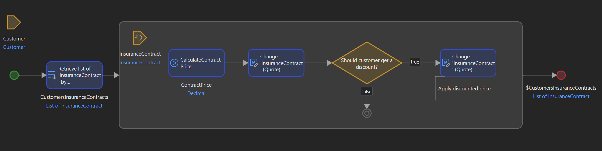

# Collaborating with business using low-code development

Has it ever happened to you while coding that you either had to:
1. Draw a diagram before starting coding to put ideas into place and have a scheme of how a process should look like?
1. Have to draw a diagram to show to a business stakeholder so that you are able to more easily explain how a process works?

I bet you've faced at least one of those situations.

## Lost in translation

There are a few problems caused by such scenarios:
1. The biggest one is that some information will inevitably be lost in translation. Some information will be lost in the intermediate step of drawing a diagram, whether you plan to write code from it later or you draw it based on existing code.
2. It takes time and energy to make a more visual model of what needs to be done.

## How low-code can help

One of the biggest advantages of low-code development is _visual programming_ where instead of writing text you drag and drop or draw elements that eventually do something you expect.

Let's consider the example below:

Are you able to deduce what is done in this flow? (called _microflow_ in [Mendix](https://www.mendix.com/))

I would argue even a non-technical person will understand the gist of it.

We get the following benefits of visual programming in this case:
1. Both you and the more business-oriented person (but anyone can benefit from this really) will have a much more intuitive representation of a business process. And it's an actual piece of software that runs and is constantly evolving, not some document that stays hidden away in Confluence and eventually becomes obsolete.
1. It's quicker as we can understand drawings much faster than we can read text. 
1. It's shared because the other person, even if they don't have a lot of technical skills, will be able to figure out more or less what they are seeing. It can also be used in meetings/presentations.
1. Less information will be lost in translation as there are simply fewer steps for information to travel.

There are some drawbacks too:
1. Poorly implemented microflows would still be difficult to understand.
1. Some training is still needed. Any visual programming tool still has a _notation_ which, even if simple, requires at least minimal investment to understand.

## Conclusion

It's a simple use case, but stacked up over time, over many interactions can add up to significantly less time used for such activities and likely producing better results due to less friction in knowledge sharing.

You still need to follow good programming practices with low-code:
1. Avoid microflows with too much stuff in it. Just like in normal programming, code that executes business logic should be quite clear to read and not overloaded with technical calls.
1. Don't be afraid of long variable/object names. This is descriptive and most of the time avoids the need for comments, which tend to not be updated as logic changes.

As low-code tooling continues to evolve, I feel like the gap between developer and business knowledge will grow ever smaller, benefiting everyone involved.