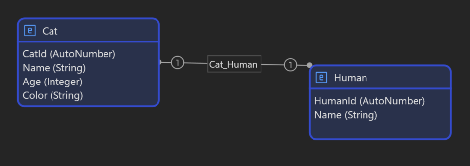

# Converting JPA entities to Mendix

Recently while exploring Mendix, I've noticed they had a [Platform SDK](https://docs.mendix.com/apidocs-mxsdk/mxsdk/) which allows you to interact with the mendix app model through an API.

This gave me an idea to explore if it can be used to create our domain model. Specifically, to create a domain model based on an existing traditional application.

If generalized further, this could be used to convert any existing application into Mendix and continue development from there.

## Converting a Java/Spring web application to Mendix

So, I created a small Java/Spring web application with a simple API and database layer. It uses an embedded H2 database for simplicity.

In this post, we are only going to be converting JPA entities. Let's take a look at them:

```java
@Entity
@Table(name = "CAT")
class Cat {
    @Id
    @GeneratedValue(strategy = GenerationType.AUTO)
    private Long id;

    private String name;
    private int age;
    private String color;

    @OneToOne
    private Human humanPuppet;
    
    ... constructor ...
    ... getters ...
}

@Entity
@Table(name = "HUMAN")
public class Human {
    @Id
    @GeneratedValue(strategy = GenerationType.AUTO)
    private Long id;

    private String name;

    ... constructor ...
    ... getters ...
}
```

As you can see they are quite simple: a `Cat` with a name, age, color, and its `Human` puppet, since cats rule the world as we know.

Both of them have an auto-generated ID field. `Cat` has a one-to-one association with a Human so that it can call its human whenever it wants. (If it wasn't a JPA entity I would have put a `meow()` method but let's leave that for the future).

The app is fully functioning but right now we're only interested in the data layer.

## Extracting Entity metadata in json

This can be done in a few different ways: 

1. By statically analyzing entities in their package.
1. By using reflection to read those entities at runtime.

I've opted for option 2 because it's quicker and I couldn't easily find a library that can do option 1.

Next, we need to decide how to expose json once we build it. To make things simple, we'll just write it into a file. Some alternative ways could be:

* Exposing it through an api. This is more complicated as you also need to ensure that endpoint is secured very well as we must not expose our metadata publicly.
* Exposing it through some management tool, like spring boot actuator, or jmx. It's safer, but still takes time to setup.

Let's now see the actual code:

```java
public class MendixExporter {
    public static void exportEntitiesTo(String filePath) throws IOException {
        AnnotatedTypeScanner typeScanner = new AnnotatedTypeScanner(false, Entity.class);

        Set<Class<?>> entityClasses = typeScanner.findTypes(JavaToMendixApplication.class.getPackageName());
        log.info("Entity classes are: {}", entityClasses);

        List<MendixEntity> mendixEntities = new ArrayList<>();

        for (Class<?> entityClass : entityClasses) {
            List<MendixAttribute> attributes = new ArrayList<>();
            for (Field field : entityClass.getDeclaredFields()) {

                AttributeType attributeType = determineAttributeType(field);
                AssociationType associationType = determineAssociationType(field, attributeType);
                String associationEntityType = determineAssociationEntityType(field, attributeType);

                attributes.add(
                        new MendixAttribute(field.getName(), attributeType, associationType, associationEntityType));
            }
            MendixEntity newEntity = new MendixEntity(entityClass.getSimpleName(), attributes);
            mendixEntities.add(newEntity);
        }

        writeToJsonFile(filePath, mendixEntities);
    }
    ...
}
```

We start with finding all classes in our app marked with JPA's `@Entity` annotation.
Then, for each class, we:

1. Get the declared fields with `entityClass.getDeclaredFields()`.
1. Loop each field of that class.

For each field then, we:

1. Determine the attribute's type:

    ```java
    private static final Map<Class<?>, AttributeType> JAVA_TO_MENDIX_TYPE = Map.ofEntries(
            Map.entry(String.class, AttributeType.STRING),
            Map.entry(Integer.class, AttributeType.INTEGER),
            ...
            );
    // we return AttributeType.ENTITY if we cannot map to anything else
    ```

    Essentially we just match the java type with our custom enum values by looking them up in `JAVA_TO_MENDIX_TYPE` map.

1. Next, we check if this attribute is actually an association (points to another `@Entity`). If so, we determine the type of an association it is: one-to-one, one-to-many, many-to-many:

    ```java
    private static AssociationType determineAssociationType(Field field, AttributeType attributeType) {
        if (!attributeType.equals(AttributeType.ENTITY))
            return null;
        if (field.getType().equals(List.class)) {
            return AssociationType.ONE_TO_MANY;
        } else {
            return AssociationType.ONE_TO_ONE;
        }
    }
    ```

    To do that, we just check the previously mapped attribute type. In case it's `Entity`, which just means that in the step before we couldn't map it to any primitive java type, String, or Enum.
    Then we also need to decide what kind of association it is. The check is simple: if it's a `List` type, then it's a one-to-many, otherwise one-to-one (did not implement 'many-to-many' yet).

1. We then create a `MendixAttribute` object for each field found.

Once that is done, we just create a `MendixEntity` object for the entity with a list of attributes assigned.
`MendixEntity` and `MendixAttribute` are classes we will use to map to json later:

```java
public record MendixEntity(
        String name,
        List<MendixAttribute> attributes) {
}

public record MendixAttribute(
        String name,
        AttributeType type,
        AssociationType associationType,
        String entityType) {

    public enum AttributeType {
        STRING,
        INTEGER,
        DECIMAL,
        AUTO_NUMBER,
        BOOLEAN,
        ENUM,
        ENTITY;
    }

    public enum AssociationType {
        ONE_TO_ONE,
        ONE_TO_MANY
    }
}
```

Finally, we save a `List<MendixEntity>` to a json file using jackson.

## Importing entities into Mendix

Here comes the fun part, how do we read the json file we generated above and create mendix entities from it?

Mendix's [Platform SDK](https://docs.mendix.com/apidocs-mxsdk/mxsdk/) has a Typescript API to interact with it.
First we will create objects to represent our entities and attributes, as well as enums for association and attribute types:

```typescript
interface ImportedEntity {
    name: string;
    generalization: string;
    attributes: ImportedAttribute[];
}

interface ImportedAttribute {
    name: string;
    type: ImportedAttributeType;
    entityType: string;
    associationType: ImportedAssociationType;
}

enum ImportedAssociationType {
    ONE_TO_ONE = "ONE_TO_ONE",
    ONE_TO_MANY = "ONE_TO_MANY"
}

enum ImportedAttributeType {
    INTEGER = "INTEGER",
    STRING = "STRING",
    DECIMAL = "DECIMAL",
    AUTO_NUMBER = "AUTO_NUMBER",
    BOOLEAN = "BOOLEAN",
    ENUM = "ENUM",
    ENTITY = "ENTITY"
}
```

Next, we need to get our app with an appId, create a temporary working copy, open the model, and find the domain model we are interested in:

```typescript
const client = new MendixPlatformClient();
const app = await client.getApp(appId);
const workingCopy = await app.createTemporaryWorkingCopy("main");
const model = await workingCopy.openModel();
const domainModelInterface = model.allDomainModels().filter(dm => dm.containerAsModule.name === MyFirstModule")[0];
const domainModel = await domainModelInterface.load();
```

The SDK will actually pull our mendix app from git and work on that.

After reading from the json file, we will loop the entities:

```typescript
function createMendixEntities(domainModel: domainmodels.DomainModel, entitiesInJson: any) {
    const importedEntities: ImportedEntity[] = JSON.parse(entitiesInJson);

    importedEntities.forEach((importedEntity, i) => {
        const mendixEntity = domainmodels.Entity.createIn(domainModel);
        mendixEntity.name = importedEntity.name;

        processAttributes(importedEntity, mendixEntity);
    });

    importedEntities.forEach(importedEntity => {
        const mendixParentEntity = domainModel.entities.find(e => e.name === importedEntity.name) as domainmodels.Entity;
        processAssociations(importedEntity, domainModel, mendixParentEntity);
    });
}
```

Here we use `domainmodels.Entity.createIn(domainModel);` to create a new entity in our domain model and assign a name to it. We can assign more properties, like documentation, indexes, even location where the entity will be rendered in the domain model.

We process the attributes in a separate function:

```typescript
function processAttributes(importedEntity: ImportedEntity, mendixEntity: domainmodels.Entity) {
    importedEntity.attributes.filter(a => a.type !== ImportedAttributeType.ENTITY).forEach(a => {
        const mendixAttribute = domainmodels.Attribute.createIn(mendixEntity);
        mendixAttribute.name = capitalize(getAttributeName(a.name, importedEntity));
        mendixAttribute.type = assignAttributeType(a.type, mendixAttribute);
    });
}
```

The only thing here we have to put some effort in is to map the attribute type to a valid mendix type.

Next we process the associations. Firstly, since in our Java entities associations were declared by a field, we need to distinguish which fields are simple attributes, and which are associations. To do that we just need to check if it's an `ENTITY` type or a primitive type:

```typescript
importedEntity.attributes.filter(a => a.type === ImportedAttributeType.ENTITY) ...
```

Let's create the associations:

```typescript
const mendixAssociation = domainmodels.Association.createIn(domainModel);

const mendixChildEntity = domainModel.entities.find(e => e.name === a.entityType) as domainmodelsEntity;
mendixAssociation.name = `${mendixParentEntity?.name}_${mendixChildEntity?.name}`;
mendixAssociation.parent = mendixParentEntity;
mendixAssociation.child = mendixChildEntity;

mendixAssociation.type = a.associationType === ImportedAssociationType.ONE_TO_ONE || a.associationType === ImportedAssociationType.ONE_TO_MANY ?
    domainmodels.AssociationType.Reference : domainmodels.AssociationType.ReferenceSet;
mendixAssocation.owner = a.associationType === ImportedAssociationType.ONE_TO_ONE ? domainmodelsAssociationOwner.Both : domainmodels.AssociationOwner.Default;
```

We have 4 important properties to set, besides the name:

1. The parent entity. This is the current entity.
2. The child entity. In the last step, we created mendix entities for each java entity. Now we just need to find the matching entity based on the type of the java field in our entity:

    ```typescript
    domainModel.entities.find(e => e.name === a.entityType) as domainmodelsEntity;
    ```

3. Association type. If it's one-to-one, it maps to a `Reference`. If it's one-to-many, it maps to a `Reference Set`. We will skip many-to-many for now.
4. The association owner. Both one-to-one and many-to-many associations have the same owner type: `Both`. For one-to-one, the owner type must be `Default`.

The Mendix Platform SDK will have created the entities in its local working copy of our mendix application. Now we just need to tell it to commit the changes:

```typescript
async function commitChanges(model: IModel, workingCopy: OnlineWorkingCopy, entitiesFile: string) {
    await model.flushChanges();
    await workingCopy.commitToRepository("main", { commitMessage: `Imported DB entities from ${entitiesFile}` });
}
```

After a few seconds, you can open the app in Mendix Studio Pro and verify the results:


There you have it: a `Cat` and `Human` entity with a one-to-one association in between them.

If you'd like to experiment yourself or see the full code, head over to [this repo](https://github.com/ragutislt/mendix-exporter-from-java-demo/tree/main).

## Ideas for the future

1. In this example I've used a Java/Spring application to convert from since I'm most proficient in it but any application can be used. 
It's enough to just be able to read type data (statically or at runtime) to extract the class and field names.
1. I'm curious to try reading and exporting some java logic to Mendix microflows. We probably can't really convert the business logic itself but we should be able to get the structure of it (business method signatures at least?).
1. The code from this article could be generalized and made into a library: the json format can stay the same, and there could be one library to export java types, and another one to import mendix entities.
1. We could use the same approach to do the reverse: convert a mendix to another language.

## Conclusion

The [Mendix Platform SDK](https://docs.mendix.com/apidocs-mxsdk/mxsdk/) is a powerful feature allowing to interact with the mendix app programmatically. They list some [sample use cases](https://docs.mendix.com/apidocs-mxsdk/mxsdk/sdk-use-cases/) like importing/exporting code, analyzing app complexity.
Have a look at them in case you are interested.
For this article, you can find the full code [here](https://github.com/ragutislt/mendix-exporter-from-java-demo/tree/main).