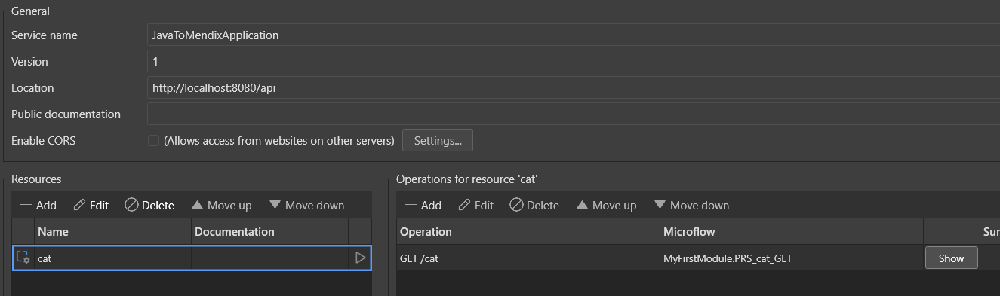

# Converting Spring MVC Rest controllers to Mendix

This is a followup to [this post about JPA entity export from Java to Mendix]().

Last time we saw how, given a Java Spring application, we can read it's metadata and 'recreate' it in a Mendix application. We detected JPA entities (based on `@Entity` annotation), exported them to a custom json schema, and finally imported everything to Mendix using their [Platform SDK](https://docs.mendix.com/apidocs-mxsdk/mxsdk/).

Now we're going to see how to convert another essential part of a Java Spring app - the REST layer.

## Sample Spring MVC app

Our sample uses the Spring MVC framework, but similar logic could be applied to Jersey or any other framework.

It has only one controller: the `CatController` (what did you think it was going to be? :P)

```java
@RestController
@RequestMapping(path = "/cat", consumes = "application/json", produces = "application/json")
public class CatController {
	private final CatService catService;

	public CatController(CatService catService) {
		this.catService = catService;
	}

	@GetMapping
	public List<CatDto> allCats() {
		return catService.getCats();
	}
}
```

The controller is exposed under path `/cat` and it produces json when called with GET. It will return a list of all cats in our database.

Here are the objects we will have to convert between Java and Mendix:
1. Spring MVC application -> would be a published REST service in Mendix.
1. Spring MVC controller -> a resource in a published REST service.
1. A method corresponding to a REST endpoint -> an operation in a Mendix resource.

## Extracting controllers into json

Same as in the last article, we will be using reflection to detect controllers and api endpoints at runtime. You can see other possible alternatives pondered in the [last post](#extracting-entity-metadata-in-json).

Here's the code that gathers all this info:

```java
public static void exportRESTLayerTo(String filePath) throws IOException {
    AnnotatedTypeScanner typeScanner = new AnnotatedTypeScanner(false, RestController.class);

    Set<Class<?>> restControllerClasses = typeScanner.findTypes(JavaToMendixApplication.class.getPackageName());
    log.info("Controller classes are: {}", restControllerClasses);

    List<MendixPublishedRestService> mendixRestServices = new ArrayList<>();
    List<MendixPublishedRestServiceResource> mendixResources = new ArrayList<>();

    for (Class<?> restControllerClass : restControllerClasses) {
        List<MendixPublishedRestServiceOperation> mendixOperations = new ArrayList<>();
        for (Method method : restControllerClass.getDeclaredMethods()) {
            if (!Modifier.isPublic(method.getModifiers())) {
                continue;
            }
            Optional<MendixPublishedRestServiceOperation> restOperation = findRestOperation(
                    method.getAnnotations());
            restOperation.ifPresent(op -> mendixOperations.add(op));
        }

        MendixPublishedRestServiceResource newResource = new MendixPublishedRestServiceResource(
                retrieveControllerPath(restControllerClass), mendixOperations);
        mendixResources.add(newResource);
    }
    ...
}
```

We begin by finding all classes annotated with `@RestController`.

Then, for each controller, we:

1. Get the path specified in the `path` field of the annotation. This path will also become the name of the mendix resource.
1. We will then retrieve controller methods that correspond to our endpoints.

To find the right controller methods, we just need to pick public methods and check if their annotations correspond to any of the following Spring MVC endpoint annotations:

```java
private static final Map<Class<?>, RestOperation> JAVA_TO_MENDIX_REST_OPERATION = Map.ofEntries(
        Map.entry(GetMapping.class, RestOperation.GET),
        Map.entry(PostMapping.class, RestOperation.POST),
        Map.entry(PutMapping.class, RestOperation.PUT),
        Map.entry(DeleteMapping.class, RestOperation.DELETE)
);
```

For each such endpoint method we find, we will add it to the list of operations in the `MendixPublishedRestServiceResource` object.
For simplicity's sake we only do a basic mapping of the endpoints, but we could go deeper and also export path params, request body, headers, etc...

Finally, we create a `MendixPublishedRestService` object to contain our rest controller and export to a json file:

```java
mendixRestServices.add(new MendixPublishedRestService("JavaToMendixApplication", "api", "1", mendixResources));
writeToJsonFile(filePath, mendixRestServices);
```

Here are all the classes we used for the export:

```java
record MendixPublishedRestService(
    String serviceName, 
    String path, 
    String version, 
    List<MendixPublishedRestServiceResource> resources) {
}

record MendixPublishedRestServiceResource(
    String name, 
    List<MendixPublishedRestServiceOperation> operations) {
}

record MendixPublishedRestServiceOperation(
    String path, 
    RestOperation restOperation) {

    enum RestOperation {
        GET,
        POST,
        PUT,
        DELETE
    }
}

```

## Importing rest services into Mendix

Now we're going to use Mendix's [Platform SDK](https://docs.mendix.com/apidocs-mxsdk/mxsdk/) which has a Typescript API to interact with it.

First we'll create some objects to represent our services and controllers:

```typescript
interface ImportedRestService {
    serviceName: string;
    path: string;
    version: string;
    resources: ImportedRestResource[];
}

interface ImportedRestResource {
    name: string;
    operations: ImportedRestOperation[];
}

interface ImportedRestOperation {
    path: string;
    restOperation: string;
}
```

Then we are going to create a working copy of our Mendix app:

```typescript
const client = new MendixPlatformClient();
const app = await client.getApp(appId);

const workingCopy = await app.createTemporaryWorkingCopy("main");
const model = await workingCopy.openModel();

const module = model.allModules().filter(m => m.name === "MyFirstModule")[0];
```

The SDK will actually pull our mendix app from git and work on that.

After reading from the json file, we will loop the services.

First we create a `PublishedRestService` first in our `MyFirstModule` module.
We give it a name, version, and base path (in our case, `api`):

```typescript
importedServices.forEach(importedService => {
    const restService = rest.PublishedRestService.createIn(module);
    restService.serviceName = importedService.serviceName;
    restService.path = importedService.path;
    restService.version = importedService.version;
    restService.name = importedService.serviceName;
    ...
});
```

We then loop the resources in that service and create a `PublishedRestServiceResource` with a name (which will also be a path for that resource):

```typescript
importedService.resources.forEach(importedResource => {
    const publishedRestResource = rest.PublishedRestServiceResource.createIn(restService);
    publishedRestResource.name = importedResource.name;
    ...
});
```

Finally, we get the operations for each resource. Operations could have their own path, which will be appended to the service and resource path. We also assign an http method and create a sample microflow for that operation so that we have something to work with once the import is complete:

```typescript
importedResource.operations.forEach(op => {
    const publishedRestOperation = rest.PublishedRestServiceOperation.createIn(publishedRestResource);
    publishedRestOperation.path = op.path;
    publishedRestOperation.httpMethod = getMendixHttpMethod(op.restOperation);

    assignSampleMicroflowToOperation(module, importedResource, op, publishedRestOperation);
});
```

The Mendix Platform SDK will create the service in its local working copy of our mendix application. Now we just need to tell it to commit the changes:

```typescript
async function commitChanges(model: IModel, workingCopy: OnlineWorkingCopy, entitiesFile: string, servicesFile: string) {
    await model.flushChanges();
    await workingCopy.commitToRepository("main", 
        { commitMessage: `Imported DB entities from ${entitiesFile} and REST services from ${servicesFile}` }
    );
}
```

After a few seconds, you can open the app in Mendix Studio Pro and verify the results:


Our published rest service has been created and we can start working on the microflows behind each endpoint.

If you'd like to experiment yourself or see the full code, head over to [this repo](https://github.com/ragutislt/mendix-exporter-from-java-demo/tree/main).

## Ideas for the future

1. Improve documentation of the Mendix Platform SDK. There is a lack of user guides and often documentation on what various objects represent. My last articles were meant to mitigate this issue.
1. The examples are in Java but the same concepts can be applied for any language.
1. One day I'll make a full library out of this and try to use static code analysis instead of runtime analysis to 'export' the Java app as it will be more convenient for the user.

## Conclusion

The [Mendix Platform SDK](https://docs.mendix.com/apidocs-mxsdk/mxsdk/) is a powerful feature allowing to interact with the mendix app programmatically. We can export entire apps to mendix, although the business logic part will require more effort.

Mendix list some [sample use cases](https://docs.mendix.com/apidocs-mxsdk/mxsdk/sdk-use-cases/) like importing/exporting code, analyzing app complexity, etc...

Have a look at them in case you are interested.

For this article, you can find the full code [here](https://github.com/ragutislt/mendix-exporter-from-java-demo/tree/main).