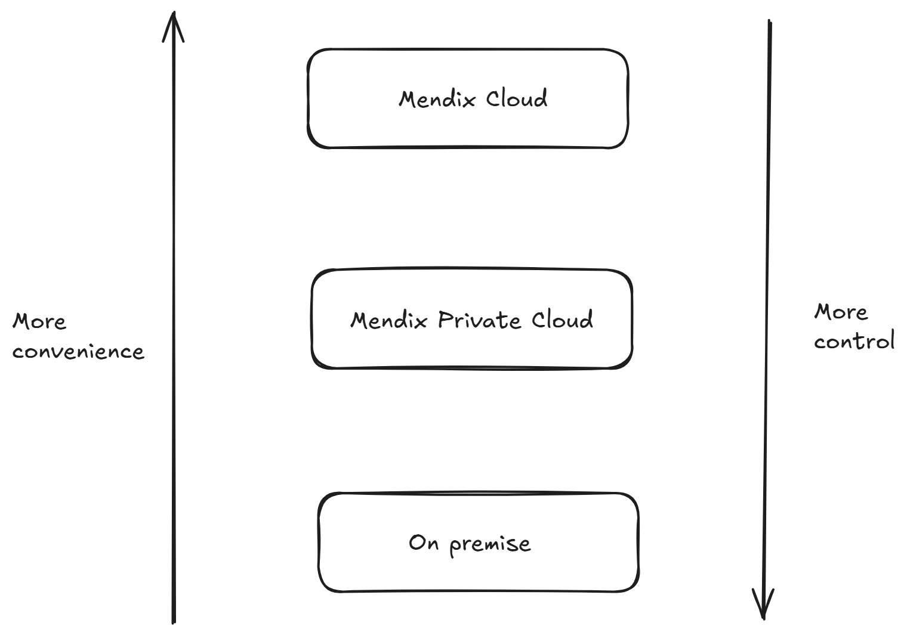
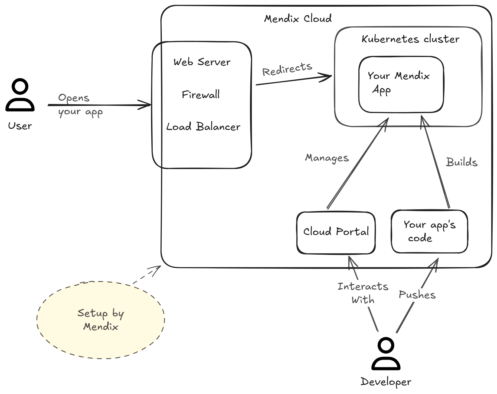
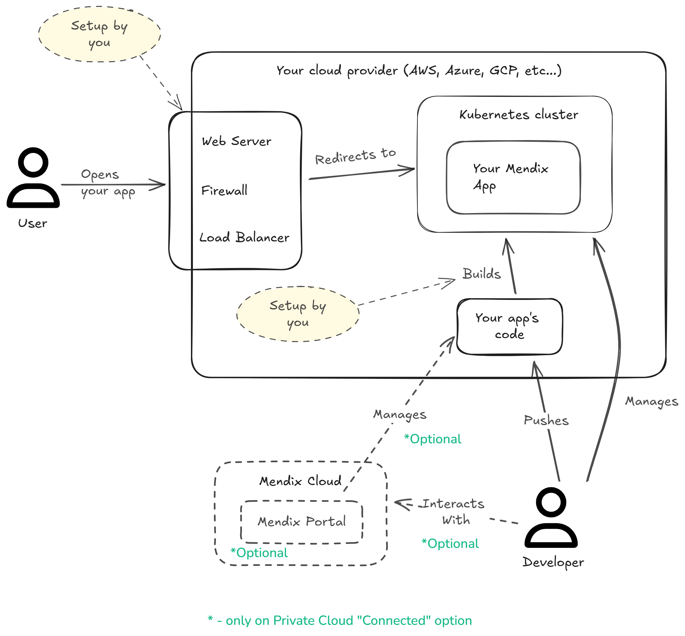
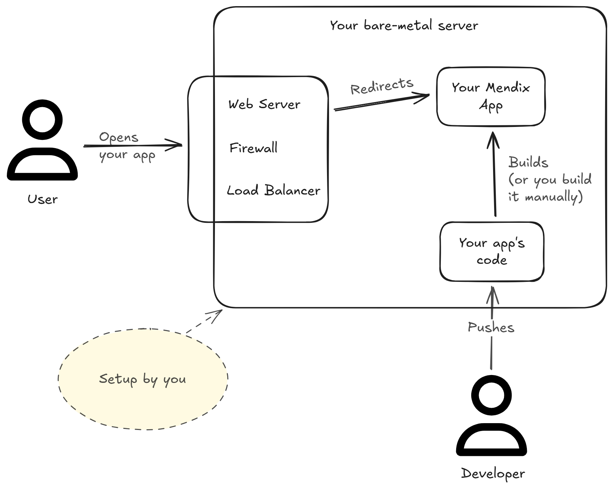

# From Code to Cloud: A Deep Dive into Mendix Deployments - Part 1

This article will begin a multiple-part series on Mendix deployments. Building applications quickly and easily with Mendix is awesome, but those applications eventually need to run on some hardware.

We're going to see how much flexibility Mendix provides based on your unique needs and capabilities.

## Deployment options

With Mendix, you have 3 main options for deploying your applications.
Here they are ordered by convenience and amount of control:

As you can see from the very professional image above, Mendix Cloud is the most convenient option, but offers the least control.

On-premise deployments, on the other end, offer least convenience, but allow for extreme levels of control.

Let's quickly recap each one.

## Mendix Cloud

The easiest option. You must estimate how many resources your app is going to need, and select a [cloud resource pack](https://docs.mendix.com/developerportal/deploy/mendix-cloud-deploy/#resource-pack) suitable for your needs.

Mostly everything then will be setup for you as you can see in the simplified image above.

With this option, you have the following advantages:
1. Ease of setup. Select your resource pack and deploy.
2. Out-of-the box tools for your app's lifecycle: monitoring, auditing, firewall, backups, etc...
3. Ensured availability based on your subscription plan.
4. You can choose the region where you want your app to be hosted.

There are some drawbacks (if you can call them that):
1. Cost. This is an obvious one - if you don't host your application, it has to be hosted somewhere, so you must pay for those resources.
However, cost is a complex subject, you need to evaluate a lot of criteria, like what skills your team possesses (and their cost in turn), how much time you're willing to spend on the operational part (which costs too), etc...
2. You have less control over the application. This is logical - if you run something on your server, you can customize it any way you want. 
With a public cloud, you have much fewer options.

## Mendix Private Cloud

Private Cloud means you host your mendix application on cloud resources that you own and directly pay for.
This can be a kubernetes cluster on a cloud provider like AWS, Google Cloud Platform, or Azure.

It can also mean a kubernetes cluster on a local instance of MicroK8s, Kind, or any other local kubernetes setup.

You also have the option to deploy an app on an OpenShift cluster.

Private Cloud is great if your organization already has a cluster that you can use, or have strict compliance and security standards which might restrict you from using any publicly-provided Cloud setups that you don't control yourself.

With Private Cloud, you are free to choose your own provider, implement your own security policies, setup your own monitoring, backup, other tools.

Cost is likely to be lower, especially if you have a skilled DevOps team who can install the mendix app in your cluster, configure the needed tools, and maintain it in the long run.

## On-premise

Lastly we have on-premise deployments.
On-premise is the old school 'it works on my machine' way.

In practice, you would probably have a bare metal server inside your company or provided by a hosting provider.
You'd run a mendix app either as:
1. A java process directly on the server.
2. A process inside a MS Internet Information Services (IIS) server.
3. A docker container on your server.

Obviously, if you have to go the on-premise way, I'd go with docker for better isolation of both your app and your server.

With these deployments you will certainly have the most control, but also the most hassle as you'll have to setup everything yourself.

For some small use cases where you don't need a kubernetes cluster but you can't use the Mendix Cloud due to compliance/security constraints, this will be the only option.

## Conclusion

Mendix provides a lot of flexibility on how to deploy your application. When you have to make a decision, consult their in-depth [decision guide](https://www.mendix.com/evaluation-guide/deployment/flexibility/decision-guide/) to make the best decision for your use case.
You'll have to take many elements into account - regulatory, security circumstances you have, the technical skills and composition of your team, your current DevOps maturity, your budget, etc...

If you'd like to learn more, head over to the Mendix documentation and stay tuned for upcoming articles. Each of these deployment options will get a deep dive of its own in the next weeks.