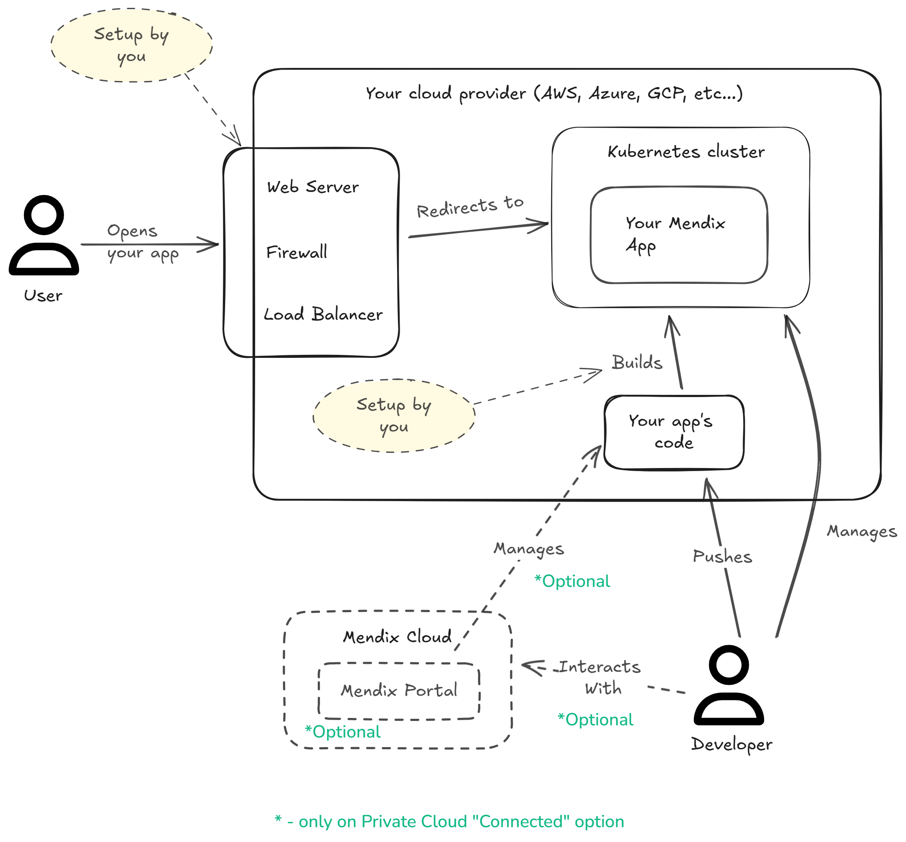
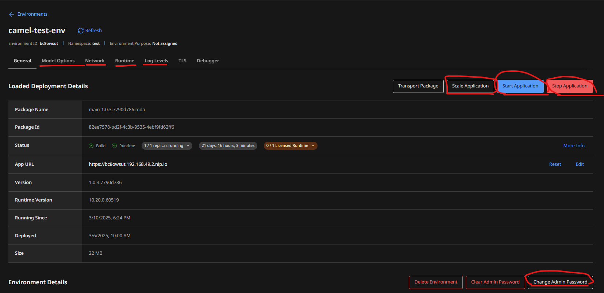
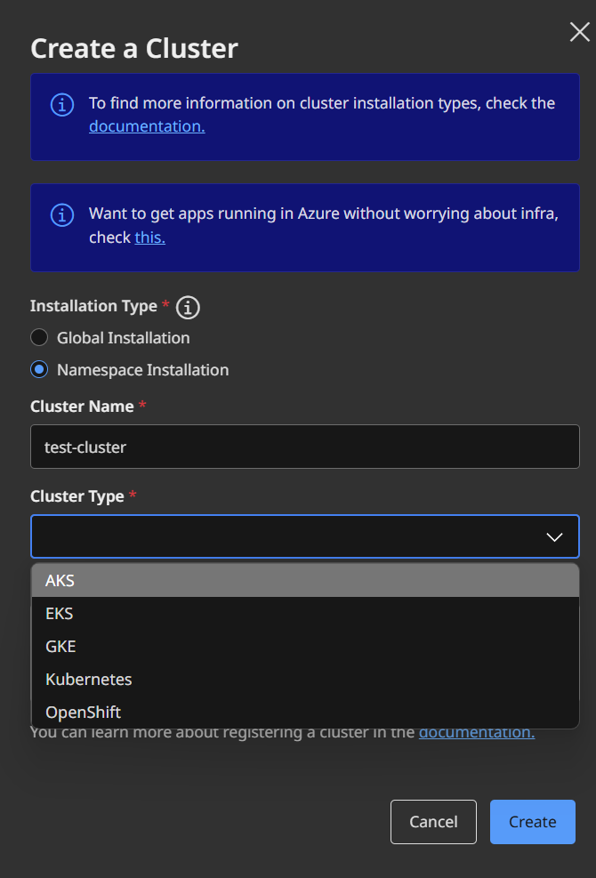
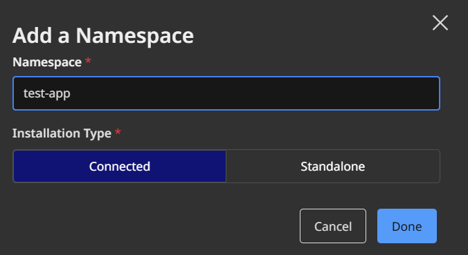
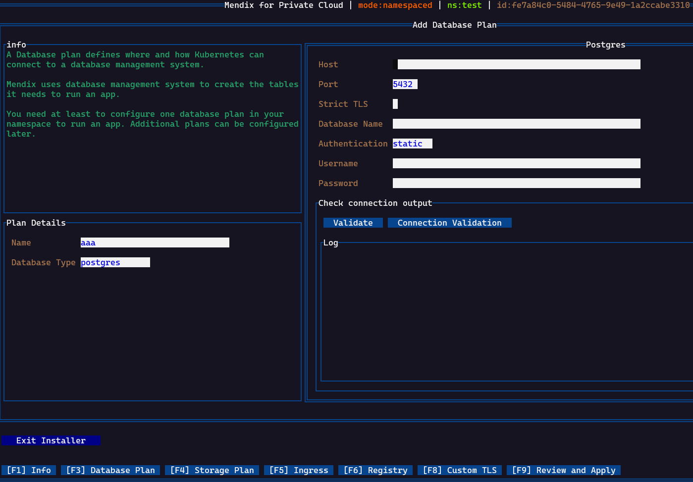
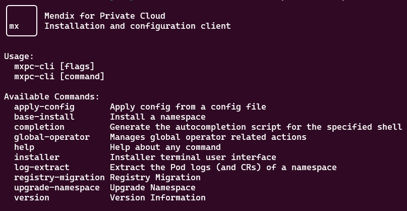
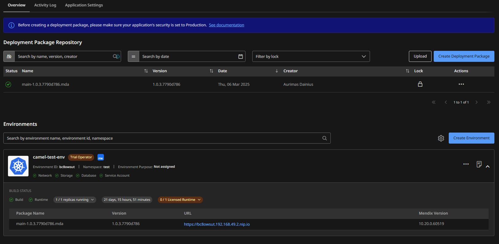

# From Code to Cloud: A Deep Dive into Mendix Deployments - Part 3: Private Cloud

In the [1st part of the series]() we have presented the various ways you can deploy a Mendix application. If you haven't read it yet, it will be a good primer for the whole series.

In this article we'll explore Private Cloud deployments.

## What is Private Cloud?

Private Cloud means using cloud-native technologies (e.g. Docker, Kubernetes) on an infrastructure that you control.
It does not have to be physically on your servers, but you need access to create and remove resources.

For the purposes of Mendix, this will mean a Kubernetes or OpenShift cluster provided by one of the [supported providers](#supported-providers).

The Kubernetes pod you deploy will contain what was described in [the on-premise overview article](#mendix-application-dissected).



From the image above, you can see that you have a lot of control with Private Cloud. 
Let's list some advantages:
1. You can decide where to physically host your cluster.
1. You decide how it will be accessed.
1. Control how deployments will work.
1. Decide your security constraints, how to protect it from outside threats.

Naturally, there are drawbacks:
1. You need to have the hardware to host your cluster.
1. You need to have the know-how of how to configure all of that.
1. You need to implement security, load-balancing, deployments, ci/cd, etc...

Whether it's right for you will depend on many organizational, technical, functional constraints. If you haven't decided yet, check out the [previous blog post]().


There are actually 2 _versions_ of the Private Cloud.

### Connected mode

In connected mode, you can manage many aspects of your app through the [Mendix Portal](https://privatecloud.mendixcloud.com/).

For example: 
* Change constants' values.
* Add JVM arguments.
* Increase the nr of replicas of your app.
* Change the admin password.
* Change log levels.
* etc...



One caveat here is that you will need to whitelist some urls from your cluster so that Mendix (the _gateway agent_ specifically) can communicate with its external portal and vice-versa. [Details here](https://docs.mendix.com/developerportal/deploy/private-cloud-cluster/#prerequisites-connected).

### Standalone mode

In standalone mode, you only interact with your cluster directly, you don't have any _control panel_ to manage it through the Mendix Portal.

## How to deploy

There are a few steps to this process:

1. Register a new cluster in the Mendix Portal.
1. Add a namespace where you will deploy your app.
1. Install the mendix operator inside your namespace.
1. Deploy your app into that cluster and namespace.

### Register a new cluster

This does not mean actually creating the cluster in Kubernetes. You must create a cluster yourself in whichever K8s (or OpenShift) provider and then just tell the Mendix Portal that it exists.



### Add a namespace

Next you need to register a namespace where your app will live.


### Install the Mendix operator

Once you've done with the cluster registration, you will get a link to download the Mendix operator.

#### Mendix operator

This operator is a separate pod that runs in your namespace. It is a [Kubernetes Operator](https://kubernetes.io/docs/concepts/extend-kubernetes/operator/) that monitors pod/pods of your Mendix app. 

Whenever you update something through the Mendix Portal (a jvm argument, the app version, etc...), the operator receives this new information and applies the necessary changes to your app's pod.

The operator itself can be configured with the `mxpc-cli` script. This script produces a yaml file with [custom resources](https://docs.mendix.com/developerportal/deploy/private-cloud-technical-appendix-01/#custom-resources) which contain the operator's configuration.

To install it, you'll run a command like:

```bash
./mxpc-cli installer -n <your namespace> -i <namespace uid> -s <secret> 
```

Once installed you can either use the non-interactive mode and configure it via commands, or use the interactive mode and configure it using a UI:


This utility also allows you to do other things, here's the help message from it:


Once configured, the operator will establish a connection to your database, storage, registry to confirm that the configuration is correct.

The configuration of the operator and your app is saved in custom K8S resources: _OperatorConfiguration_, _MendixApp_, ...

You can of course inspect them:

```bash
kubectl get OperatorConfiguration -n test -oyaml | less
```

```yaml
apiVersion: v1
items:
- apiVersion: privatecloud.mendix.com/v1alpha1
  kind: OperatorConfiguration
  metadata:
    annotations: ...
    name: mendix-operator-configuration
    namespace: test
  spec:
    baseOSImageTagTemplate: ubi8-1-jre{{.JavaVersion}}-entrypoint
    buildResources:
      limits:
        cpu: "1"
        memory: 256Mi
      requests:
        cpu: 250m
        memory: 64Mi
    endpoint:
      ingress:
        annotations:
          nginx.ingress.kubernetes.io/proxy-body-size: 500m
        domain: 192.168.49.2.nip.io
        enableTLS: true
        ingressClassName: public
        path: /*
      type: ingress
    ...
...
```

This means you could also save this yaml in your gitops repository, version it, template it, and use for future deployments even without the _mxpc-cli_ utility.

### Deploy the app

Now you can finally deploy your app to this cluster. You need to go to your app's page in the Mendix Portal, the environments section.

You need to create the environment. This allows you to create environments that are _connected_ with different namespaces or even different clusters.

Once created, just deploy your app to that cluster.

The following will happen next:
1. The Mendix operator will receive the instructions to deploy the app.
1. It's going to start a worker pod to build a docker image of your app.
1. It will launch a pod based on the image produced just before.

You will then be able to see your app's releases and all configured environments from this page:


This page allows you to deploy a release to the environment of your choosing. Typically, you will have at least a _dev_ and a _production_ environment, but you can adapt it to your needs.

## Supported providers {#supported-providers}

As of {{ page.date | date_to_string }}, the [following](https://docs.mendix.com/developerportal/deploy/private-cloud-supported-environments/#kubernetes-cluster-types) providers or _flavours_ of k8s are supported.

## Conclusion

This was not meant to be a full guide on how to do a private-cloud deployment, as there is too much information to cover in just one article. Instead, it's meant to give an overview of what it means, what you can do with it, and why you would want to deploy to a private cloud in the first place.
For a guide with more instructions I would still refer to the official [Mendix documentation](https://docs.mendix.com/developerportal/deploy/private-cloud-cluster/) but know that sometimes it's not easy to understand everything written there, from my experience.

Hopefully this gives you more information and motivation to use it with your Mendix applications.
I will do separate articles on more detailed subjects, like: difference between connected and standalone environments, how to segregate your environments from each other, more details on the mendix operator, how to integrate a CI/CD pipeline, etc...

If you'd like more information, or need some help in setting up your deployments, don't hesitate to reach out.